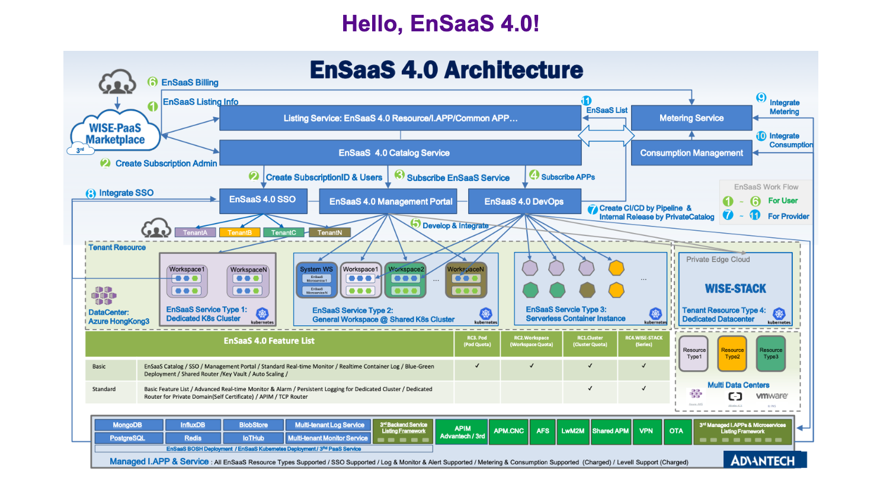

# static-page-k8s

This is a sample code to demonstrate how to deploy a simple static page to the EnSaaS 4.0.


# Deploying to the EnSaaS 4.0

## 1. Getting Your Own Credentials

Go to your [workspace](https://portal-mp-master.es.wise-paas.cn/cluster-info/workspaces) and download the credentials required to manipulate your resources.


You will get prompted to download a config file which contains important credentials. Please make sure you secure this file and **DO NOT LET ANYONE ELSE ACCESS YOUR CONFIG FILE**. You may rename it to whatever you want, say ``wisepaas-config``, and then save it to ``$HOME/.kube`` if you are using MacOS.

<br>

## 2. Setting Up KUBECONFIG

If you already have **minikube** installed on your local machine, you will have a file called ``config`` in the directory ``$HOME/.kube``, which is the default file used by Kubernetes. After you start the **minikube**, you can type ``kubectl config view`` to see the information inside this config file.

You may overwrite the ``KUBECONFIG`` environment variable to direct Kubernetes to use the new one that you just downloaded, type ``export KUBECONFIG=$HOME/.kube/wisepaas-config``. Again, you can name it accroding to personal preference. Just make sure that the envrironment variable matches your file name.

<br>

## 3. Clone the Sample Code from WISE-PaaS GitHub

```bash
git clone git@github.com:allguitars/static-page-k8s.git
cd static-page-k8s/
```

<br>

## 4. Building & Pushing Docker Image

- Specify a tag when building the image.

  ```bash
  docker build -t <DockerHubAccount>/<ImageName>:<Tag> .
  ```

  For example: ``wise-paas/static-k8s:v1.0.0``

  <br>

- Push the new image to your own Docker Repository.

  ```bash
  docker push <DockerHubAccount>/<ImageName>:<Tag>
  ```

<br>

## 5. Do a Little Bit Tuning

It requires some minimun effort to take this code and deploy it to the EnSaaS 4.0.

### I. Setting Up the Host

Modify the ``host`` attribute in ``./k8s-config/ingress-service.yaml``.


<br>

**Format:**

``ApplicationName``.``Namespace``.``ClusterName``.**internal**

Note that ``en.internal`` keyword is required at the end of the string.

<br>

### II. Change the Docker Image Name

Change the ``image`` attribute inside ``./k8s-config/static-deployment.yaml`` file according to the image you just built. You may also leave this setting with the default value to use the image we have built and pushed to the EnSaaS official Docker Hub registry.

```
<DockerHubAccount>/<ImageName>:<Tag>
```

Here is the example in this code:


<br>

### III. Setting Up the Resource Usage

Modify the ``resources`` attribute inside ``./k8s-config/static-deployment.yaml`` file. This example only uses 10m of the CPU because it is just a static webpage. However, you may try to minimize these values as possible as you can to optimiaze the resource utilization.


<br>

## 5. Applying the Configuration

**Note**: Always remember to specify the **namespace** that you are working on while applying the Kubernetes configuration.

The following screenshot shows that the namespace is *playgroud*. Yours might be different.


<br>

Apply the Kubernetes configuration.

```bash
kubectl apply -f k8s-config/ --namespace <NameSpace>
```

<br>

Check all resources (also with namespace):

```bash
kubectl get all --namespace playground

NAME                                     READY   STATUS    RESTARTS   AGE
pod/static-deployment-5d996d5d54-97zql   1/1     Running   0          124m

NAME                                TYPE        CLUSTER-IP    EXTERNAL-IP   PORT(S)    AGE
service/static-cluster-ip-service   ClusterIP   10.0.201.35   <none>        3000/TCP   124m

NAME                                READY   UP-TO-DATE   AVAILABLE   AGE
deployment.apps/static-deployment   1/1     1            1           124m

NAME                                           DESIRED   CURRENT   READY   AGE
replicaset.apps/static-deployment-5d996d5d54   1         1         1       124m
```

<br>

## 6. Verifying the Application

In the sample code, we set the host for the Ingress service.

```yaml
host: staticpage.devspace.eks004.en.internal
```

So, to see the page, we need to go to the following URL:

http://staticpage-devspace-eks004.sa.wise-paas.com

<br>

Mapping rule -- host vs. URL

- host

  ```
  {AppName}.{Namespace}.{ClusterName}.en.internal
  ```

- External URL

  ```
  {AppName}-{Namespace}-{Cluster}.sa.wise-paas.com
  ```

  <br>

The page should look like:




